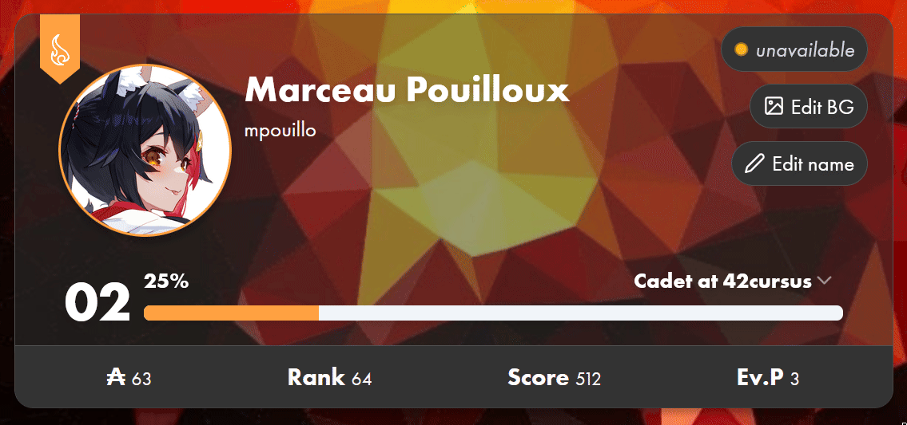
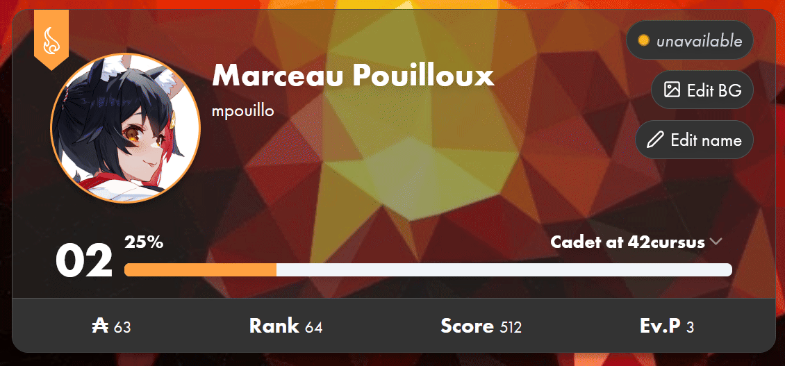

<h1 align="center"></h1>

A simple browser extension enabling quality of life features for 42's <a href="https://intra.42.fr/">intranet</a>. 
Only compatible with Intra V3 (for now).

## Quick install

## Features

### Custom user nicknames

Note: changes are only local.

### Custom profile background

Note: changes are only local.

Planned:
- Monthly logtimes display
- Pin friends on your profile
- And more...
